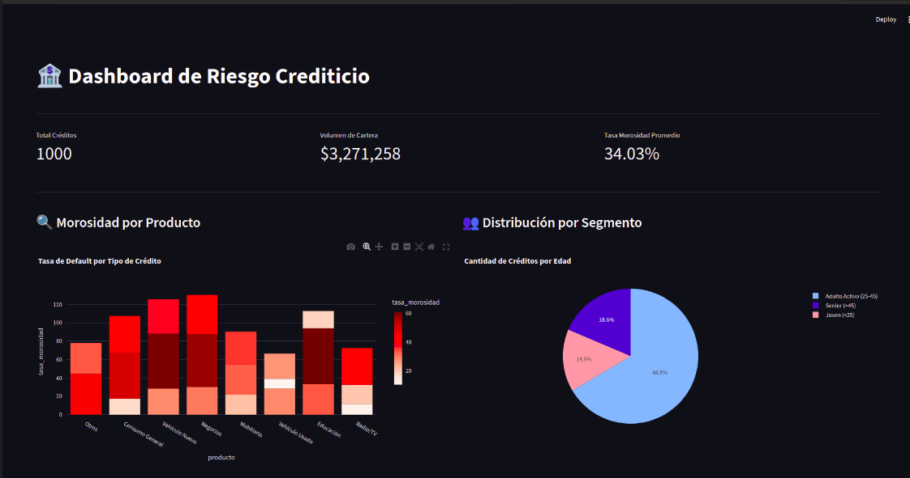

*(Note: If you don't have the image yet, delete this line)*

## 📋 Executive Summary
This project simulates a **Real-World Credit Risk Monitoring System**. 

Leveraging my 15+ years of experience in Banking and Risk Management, I engineered an automated pipeline to replace traditional manual reporting. This solution ingests raw credit data, processes it through a **Dockerized PostgreSQL database**, applies business logic via **SQL Views**, and visualizes critical KPIs (Vintage Analysis, Default Rates) in a **Streamlit** web application.

**Key Features:**
*   **End-to-End Pipeline:** From raw data (ETL) to actionable insights.
*   **Infrastructure as Code:** Fully containerized database using Docker.
*   **Business Logic in SQL:** robust risk segmentation (Age vs. Product) calculated directly in the DB layer.

## 🛠️ Tech Stack
*   **Language:** Python 3.10+
*   **Database:** PostgreSQL 15 (Docker Container)
*   **ETL & Analysis:** Pandas, SQLAlchemy
*   **Visualization:** Streamlit, Plotly
*   **Version Control:** Git

## 🚀 How to Run locally

1.  **Clone the repo:**
    ```bash
    git clone https://github.com/Donavid/credit-risk-dashboard.git
    cd credit-risk-dashboard
    ```

2.  **Start the Infrastructure:**
    ```bash
    docker-compose up -d
    ```

3.  **Install Dependencies:**
    ```bash
    python -m venv venv
    source venv/bin/activate
    pip install -r requirements.txt
    ```

4.  **Load Data (ETL):**
    ```bash
    python etl.py
    ```

5.  **Launch Dashboard:**
    ```bash
    streamlit run dashboard.py
    ```

---
*Developed by [Donar Vidal](https://www.linkedin.com/in/donar-vidal-5a4a99a8/) - Financial Data Analyst*
